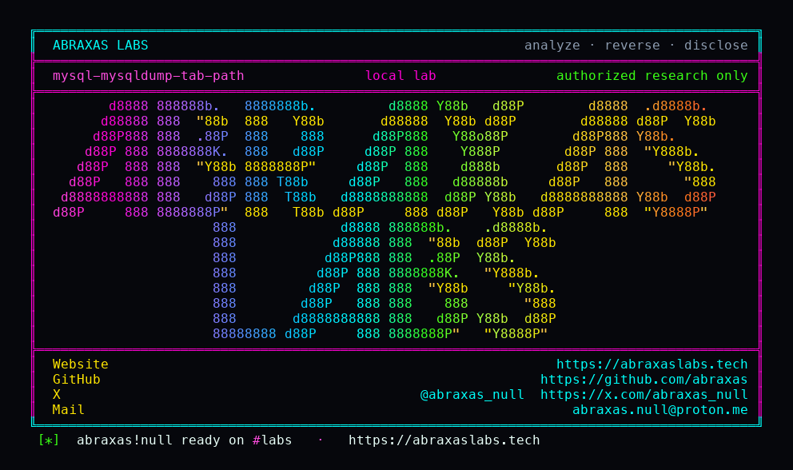

<p align="center">
  
</p>

<p align="center">
  <a href="https://abraxaslabs.tech"><strong>abraxaslabs.tech</strong></a>
  &nbsp;·&nbsp;
  <a href="https://github.com/abraxas">github.com/abraxas</a>
  &nbsp;·&nbsp;
  <a href="https://x.com/abraxas_null">@abraxas_null</a>
  &nbsp;·&nbsp;
  <a href="mailto:abraxas.null@proton.me">abraxas.null@proton.me</a>
  &nbsp;·&nbsp;
  <a href="https://github.com/abraxas/mysql-mysqldump-tab-path">mysql-mysqldump-tab-path</a>
</p>

# mysql-mysqldump-tab-path

**Class:** File write (client)
**Reach:** Remote (UI:R)

**MySQL Community Server** `mysqldump` `26.7.0` (`06a5c1c`) - Oracle

`mysqldump --tab=DIR` writes one `.sql` per table using `fn_format` **without** `MY_REPLACE_DIR`. A hostile `SHOW TABLES` name with `/` or `..` keeps that directory. DIR is ignored. The dump UID `my_fopen`s the path.

`--tab` is documented as same-machine mode because the `.txt` goes through server `INTO OUTFILE`. The `.sql` is still a **client** write.

| | |
|---|---|
| ID | no CVE yet |
| Class | **File write** (client `--tab` `.sql`) |
| Reach | **Remote** (victim runs `mysqldump --tab` against an attacker MySQL; UI:R) |
| CWE | [CWE-22](https://cwe.mitre.org/data/definitions/22.html) |
| CVSS | **High: 8.1** `CVSS:3.1/AV:N/AC:L/PR:N/UI:R/S:U/C:H/I:H/A:N` |
| Product | [MySQL Community Server](https://github.com/mysql/mysql-server) `mysqldump` |
| Affected | **26.7.0** (`06a5c1c99c377fc41b2eba1ea244e8b220bdc3c8`) |
| Auth | victim runs `mysqldump --tab=DIR` against an attacker MySQL |
| License | [GNU Affero GPL v3.0](LICENSE) |
| Lab | `127.0.0.1` only. Witness `.sql` outside DIR. |

## What an attacker can do

Stand up a MySQL-protocol server. Answer `SHOW TABLES` with `/abs/path` or `../outside`. The operator who ran `mysqldump --tab=/backup testdb` writes `/abs/path.sql` (or a path relative to cwd) as the dump UID.

Overwrite any file that UID can create. Same class as a backup client that trusts a remote filename. The `.txt` INTO OUTFILE path is server-side FILE. The leftover is the client `.sql`.

A real `mysqld` will not emit a table name with `/`. The leftover is the client.

## How I found it

Same 26.7.0 hunt as [mysqldump SHOW TABLES overflow](https://github.com/abraxas/mysql-mysqldump-show-tables-overflow). Default daemon was empty. Client tools still trusted `SHOW TABLES`. Overflow was one leftover. `--tab` was the next.

```c
static FILE *open_sql_file_for_table(const char *table, int flags) {
  FILE *res;
  char filename[FN_REFLEN], tmp_path[FN_REFLEN];
  convert_dirname(tmp_path, path, NullS);
  res = my_fopen(fn_format(filename, table, tmp_path, ".sql",
                           MYF(MY_UNPACK_FILENAME | MY_APPEND_EXT)),
                 flags, MYF(MY_WME));
  return res;
}
```

`mysys/mf_format.cc`: if `dirname_part(name)` is non-empty and `MY_REPLACE_DIR` is off, the given `dir` is not used.

Wrong turns already recorded: treating a real `mysqld` as the oracle; dying at `SHOW TABLE STATUS` before `SHOW CREATE TABLE` (the `.sql` opens only after CREATE succeeds); calling INTO OUTFILE `.txt` the leftover; a 64KiB name that re-hits the G1 overflow.

Not MariaDB [CVE-2025-13699](https://nvd.nist.gov/vuln/detail/CVE-2025-13699) (`mariadb-dump` view-name traversal). Same class, MySQL Community copy.

## Lab

```bash
cd lab
./run.sh
```

Image `mysql:26.7.0`. `--tab=/work/tabdir`. Control stub table `t` writes `work/tabdir/t.sql`. Traversal stub table `/work/oracle/MYSQL-DUMP-TAB-TRAVERSAL-WITNESS` writes `work/oracle/MYSQL-DUMP-TAB-TRAVERSAL-WITNESS.sql`. Published `127.0.0.1:18610` / `18611`. Bind it to loopback.

```text
control-sql=yes
traversal-outside=yes
SUCCESS mysql-mysqldump-tab-path ... MYSQL-DUMP-TAB-TRAVERSAL-WITNESS
```

## The fix

Pass `MY_REPLACE_DIR` into `fn_format` for `--tab` client files, or take `basename` of the table name first. `--tab=DIR` should mean DIR.

## References

- [github.com/mysql/mysql-server](https://github.com/mysql/mysql-server) tag [mysql-26.7.0](https://github.com/mysql/mysql-server/tree/mysql-26.7.0) (`06a5c1c99c377fc41b2eba1ea244e8b220bdc3c8`)
- [`client/mysqldump.cc`](https://github.com/mysql/mysql-server/blob/mysql-26.7.0/client/mysqldump.cc) `open_sql_file_for_table`
- [`mysys/mf_format.cc`](https://github.com/mysql/mysql-server/blob/mysql-26.7.0/mysys/mf_format.cc)
- Sibling overflow pack: [abraxas/mysql-mysqldump-show-tables-overflow](https://github.com/abraxas/mysql-mysqldump-show-tables-overflow)
